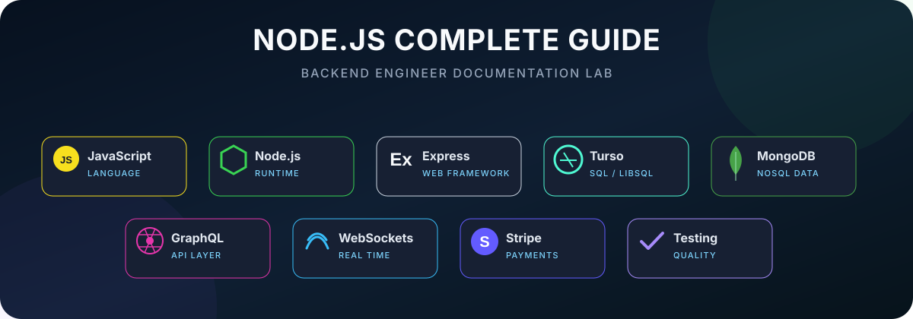
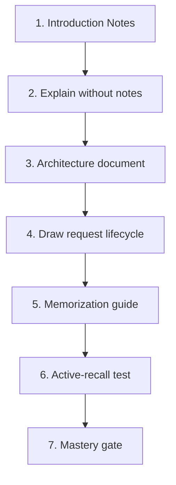
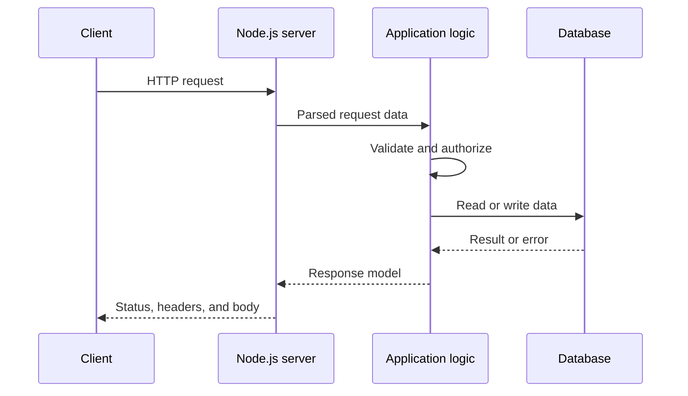
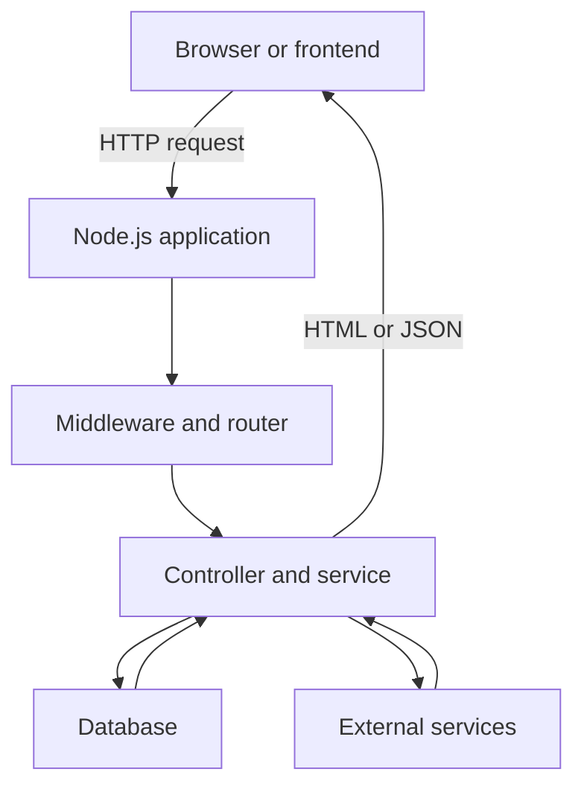

<div align="center">



# Chapter 01 — Introduction to Node.js

### Runtime Fundamentals · Server-Side Development · Architecture · Active Recall

[](./introduction-notes.md)
[](#mastery-gate)
[](https://nodejs.org/)

</div>

---

## Chapter Purpose

Chapter 01 establishes the mental model required for the rest of **Node.js — The Complete Guide**.

The purpose is not to memorize that “Node.js is used for backend development.” The goal is to understand:

- What Node.js actually is
- How it differs from JavaScript and Express
- What server-side development means
- How clients, servers, databases, and external services communicate
- How server-rendered HTML differs from an API response
- Why an online shop requires trusted backend logic
- How to think about backend systems from a senior-engineering perspective

## Chapter Documents

| Document | Purpose | Status |
|---|---|---|
| [Introduction Notes](./introduction-notes.md) | Answer review, corrected explanations, examples, and memorization system | Complete |
| [Introduction Memorization](./introduction-memorization.md) | Short answers, active recall, spaced repetition, and self-testing | Complete |
| [Architecture](./architecture.md) | Runtime boundary, request lifecycle, system layers, trust boundaries, failures, and performance | Complete |

## Recommended Study Order



1. Read [Introduction Notes](./introduction-notes.md).
2. Answer the core questions without looking.
3. Study [Architecture](./architecture.md).
4. Draw the request lifecycle from memory.
5. Complete [Introduction Memorization](./introduction-memorization.md).
6. Repeat the questions using spaced repetition.
7. Complete the mastery checklist on this page.

## Learning Objectives

By the end of Chapter 01, I should be able to:

1. Define Node.js accurately.
2. Explain why Node.js is not a programming language.
3. Explain the difference between JavaScript, Node.js, and Express.
4. Describe server-side development.
5. Trace a basic HTTP request and response.
6. Compare server-rendered HTML with an API.
7. Explain why an online shop needs a backend.
8. Identify the primary backend layers.
9. Identify trust boundaries and common failure paths.
10. Explain the main security and performance concerns introduced in this chapter.

## Core Definition

> Node.js is a JavaScript runtime that executes JavaScript outside the browser and provides APIs for building servers, command-line tools, background processes, and backend applications.

### Three-Part Memory Formula

```text
What is it? → A JavaScript runtime
How does it work? → Executes JavaScript outside the browser
Why use it? → Builds servers, APIs, tools, and backend applications
```

## JavaScript, Node.js, and Express

| Technology | What it is | Responsibility |
|---|---|---|
| JavaScript | Programming language | Describes application behavior |
| Node.js | Runtime environment | Executes JavaScript outside the browser |
| Express.js | Web framework | Organizes middleware, routes, requests, and responses |

```text
JavaScript code
→ executed by Node.js
→ organized as a web application with Express
```

## Server-Side Development

Server-side development means writing code that runs on a server rather than inside the user’s browser.

Server-side code commonly handles:

- HTTP requests and responses
- Business rules
- Authentication and authorization
- Database operations
- Product and inventory management
- Orders and payments
- File uploads
- Email and external integrations
- Validation, logging, and error handling

## Basic Request Lifecycle



### Request Flow

```text
Client
→ Node.js HTTP boundary
→ Middleware
→ Router
→ Controller
→ Service
→ Database or external service
→ Response
```

## Server-Rendered HTML Versus API

| Area | Server-rendered application | API-based application |
|---|---|---|
| Server returns | Complete HTML | Data, usually JSON |
| Rendering owner | Server and template engine | Frontend application |
| Common consumer | Web browser | React, mobile app, another service |
| Example | EJS product page | `GET /api/products` |

### Simple Memory Answer

> Server rendering returns complete HTML, while an API returns data that the frontend uses to build the interface.

## Why an Online Shop Needs a Backend

An online shop needs a backend to manage authoritative and sensitive operations:

- Users and authentication
- Roles and permissions
- Products and categories
- Trusted prices
- Inventory
- Shopping carts
- Orders
- Payment processing
- Private customer information
- Validation and error handling

The client cannot be trusted to control prices, permissions, inventory, or payment confirmation.

## Architecture Overview



Read the complete architecture analysis in [architecture.md](./architecture.md).

## Trust Boundaries

Treat all client-provided information as untrusted:

- Request bodies
- URL parameters
- Query parameters
- Headers and cookies
- Uploaded files
- User IDs and role names
- Product prices and totals

```text
Untrusted request
→ validation
→ authentication
→ authorization
→ business operation
→ database or external dependency
```

## Security Preview

- Never store plain-text passwords.
- Validate all user-controlled input.
- Enforce authentication and authorization on the server.
- Keep secrets outside source code.
- Never trust prices received from the browser.
- Do not expose password hashes, tokens, stack traces, or internal queries.
- Restrict uploaded file types and sizes.
- Rate-limit sensitive endpoints.

## Performance Preview

- Avoid blocking the Node.js event loop.
- Prefer asynchronous I/O APIs.
- Paginate large collections.
- Avoid unnecessary database queries.
- Add indexes based on actual query patterns.
- Stream large files when appropriate.
- Measure performance before optimizing.

## Core Questions

Answer these without reading the documents:

1. What is Node.js?
2. Is Node.js a programming language?
3. What is the difference between JavaScript, Node.js, and Express?
4. What does server-side development mean?
5. How is server-rendered HTML different from an API?
6. Why does an online shop need a backend?
7. What happens from the moment a client sends a request until it receives a response?
8. Why should the server never trust a price sent by the frontend?
9. Which work can block the Node.js event loop?
10. What happens when a database or external dependency fails?

## Practical Work

### Exercise 1 — First Node.js Program

```javascript
console.log("My Node.js Backend Engineer journey begins.");
```

Run it with:

```bash
node app.js
```

### Exercise 2 — Runtime Explanation

Write one paragraph explaining:

```text
JavaScript → Node.js runtime → operating system and server capabilities
```

### Exercise 3 — Request Map

Draw this flow without copying:

```text
Client → Node.js → application logic → database → response
```

### Mini-Project — Course Roadmap API

Build a basic Node.js HTTP server that returns:

```json
{
  "course": "Node.js — The Complete Guide",
  "chapter": "01 — Introduction",
  "status": "learning"
}
```

## Memorization Protocol

Use the **Cover–Recall–Check** method:

1. Read the correct answer once.
2. Hide the answer.
3. Explain it aloud.
4. Write it from memory.
5. Compare your answer.
6. Correct only the inaccurate or missing parts.
7. Repeat until the answer feels natural.

### Review Schedule

| Review | Time |
|---|---|
| Review 1 | Immediately after studying |
| Review 2 | Next day |
| Review 3 | After 3 days |
| Review 4 | After 7 days |
| Review 5 | After 14 days |
| Review 6 | After 30 days |

## Mastery Gate

Chapter 01 is mastered when I can:

- [ ] Define Node.js without notes.
- [ ] Explain JavaScript versus Node.js versus Express.
- [ ] Explain server-side development with a real example.
- [ ] Trace the request lifecycle from memory.
- [ ] Compare server-rendered HTML and APIs.
- [ ] Name at least five online-shop backend responsibilities.
- [ ] Identify the chapter’s trust boundaries.
- [ ] Explain one database failure path.
- [ ] Identify common event-loop performance risks.
- [ ] Run the first Node.js program.
- [ ] Build the Course Roadmap API independently.
- [ ] Complete the active-recall review after 1, 3, 7, 14, and 30 days.

## Chapter Progress

| Area | Status |
|---|---|
| Learning notes | ✅ Complete |
| Corrected answers | ✅ Complete |
| Memorization guide | ✅ Complete |
| Architecture analysis | ✅ Complete |
| First Node.js script | 🔄 Practice |
| Course Roadmap API | 🔄 Practice |
| Active recall | 🔄 Reviewing |
| Final mastery | ⬜ Not yet verified |

## Senior Developer Takeaway

A beginner asks: **How do I create this route?**

A senior engineer also asks:

1. Who may call it?
2. Is the input validated?
3. Which layer owns the business rule?
4. What happens when a dependency fails?
5. Is the operation secure?
6. Can it handle increased traffic?
7. How are failures logged and observed?
8. How will it be tested?
9. Which data should be returned?
10. Which information must never be exposed?

## Final Chapter Summary

Node.js is the runtime that executes JavaScript outside the browser. It provides the capabilities required to build server-side applications, but the application architecture determines how requests, business rules, databases, authentication, failures, security, and performance are handled.

```text
Understand the runtime
→ trace the request
→ identify responsibility ownership
→ secure the boundaries
→ handle failures
→ measure performance
→ prove mastery through implementation
```

---

<div align="center">

[⬆ Back to Course README](../../README.md) · [Read Introduction Notes](./introduction-notes.md) · [Study Architecture](./architecture.md) · [Practice Memorization](./introduction-memorization.md)

**Learn deeply. Explain clearly. Build independently.**

</div>
