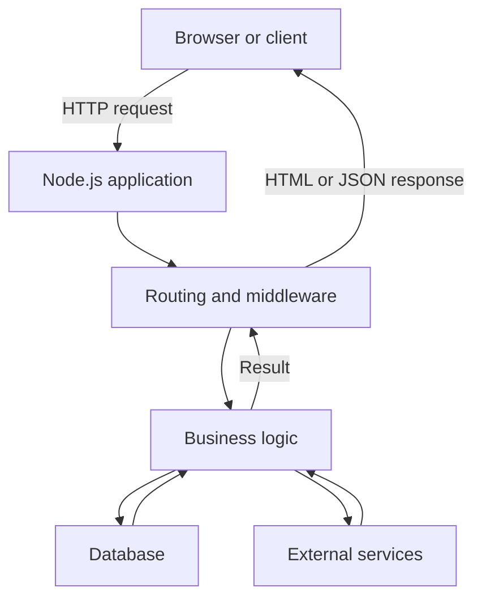
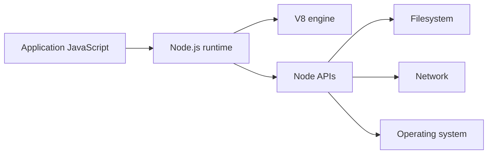
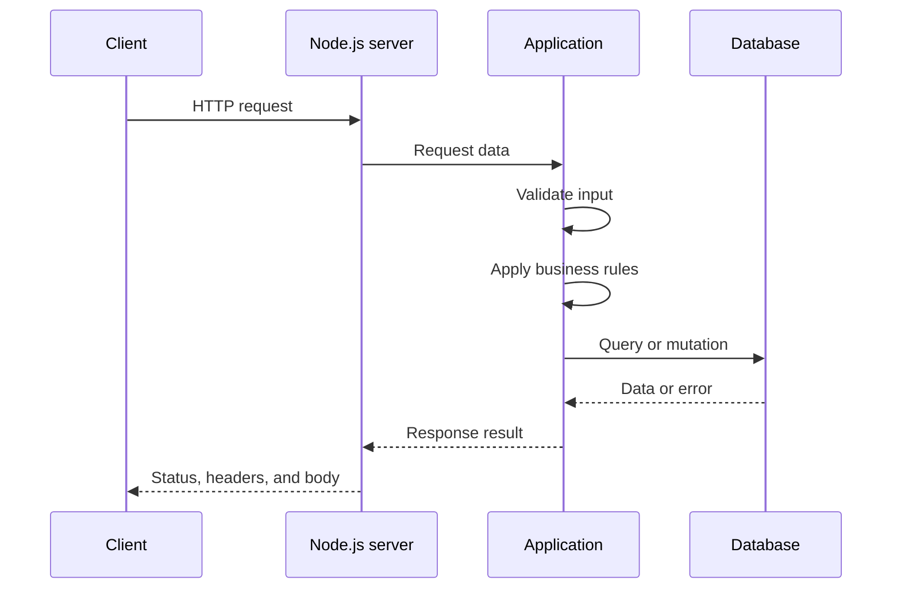
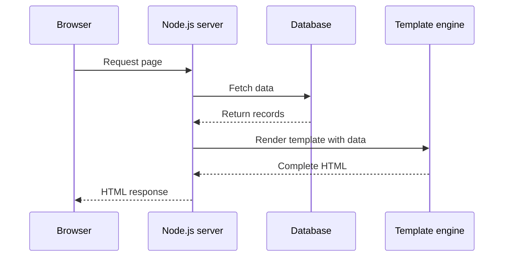
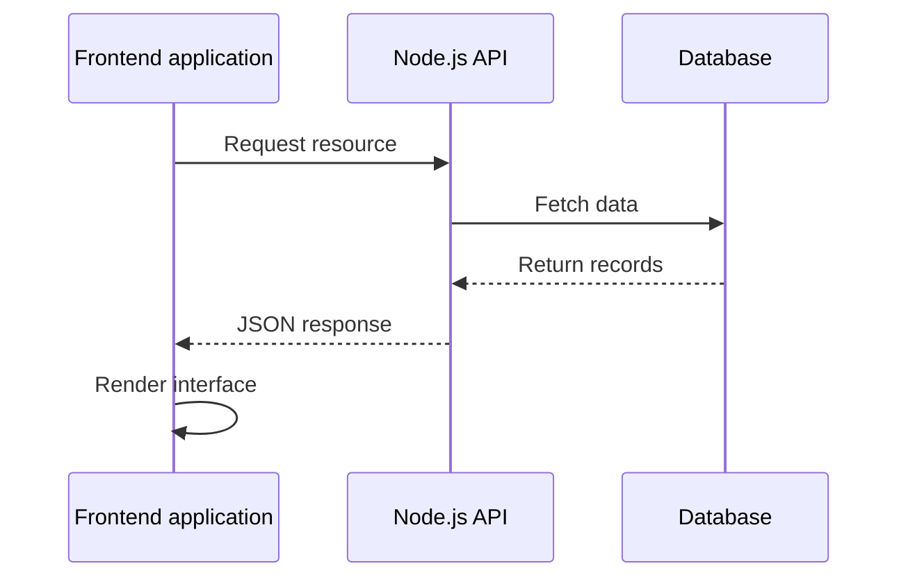
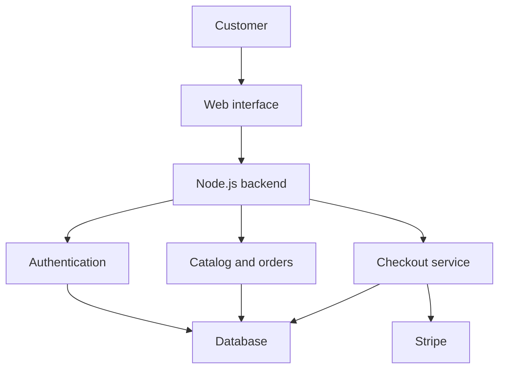
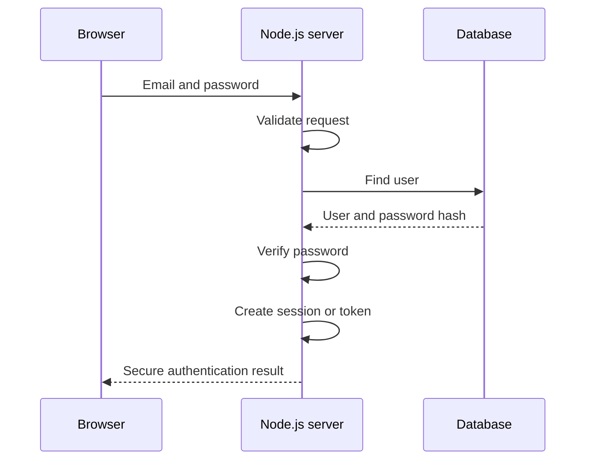
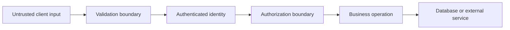
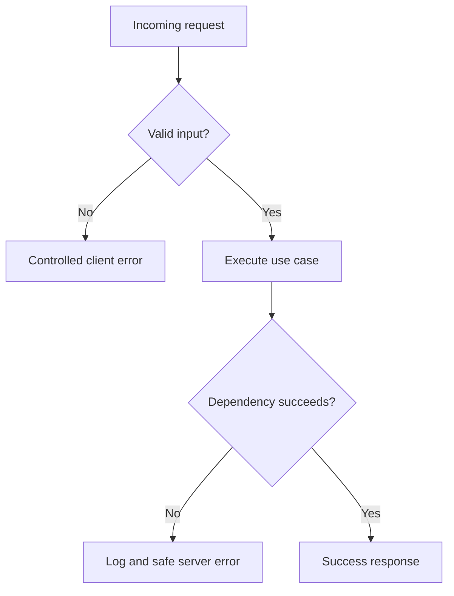

# 01 — Introduction: Node.js Architecture

## Architecture Objective

Understand where Node.js sits inside a backend system, how a request travels through the application, which layer owns each responsibility, and where security, failure, and performance risks appear.

## Core Mental Model

Node.js is not the complete backend architecture. It is the runtime that executes the JavaScript application.

```text
JavaScript = programming language
Node.js = runtime environment
Express = web framework running on Node.js
Application = routes, business rules, data access, and integrations
Infrastructure = database, file storage, payment service, email, and deployment platform
```

## High-Level System Architecture



## System Layers

| Layer | Responsibility | Examples |
|---|---|---|
| Client | Sends requests and displays results | Browser, React application, mobile application |
| Runtime | Executes server-side JavaScript | Node.js and V8 |
| Transport | Receives and returns HTTP messages | Node `http`, Express request and response |
| Middleware | Applies cross-cutting request rules | Parsing, authentication, validation, logging |
| Router | Matches a request to an application operation | `GET /products`, `POST /login` |
| Controller | Translates HTTP input into an application call | Read parameters, call service, choose response |
| Service | Owns business rules and use-case orchestration | Checkout, registration, order creation |
| Data access | Reads and writes persistent information | Repository, model, query module |
| Database | Stores authoritative application state | Turso/libSQL, SQL database, MongoDB |
| Integration | Communicates with external systems | Stripe, email, file storage |

## Node.js Runtime Boundary



### V8

V8 parses, compiles, and executes JavaScript.

### Node APIs

Node.js exposes server-side capabilities such as:

- HTTP networking
- Filesystem operations
- Streams and buffers
- Process information
- Timers
- Cryptography
- Operating-system interaction

### Application Code

The application combines the runtime APIs with business logic. Node.js does not automatically know what a product, user, order, permission, or payment means. Those rules belong to the application.

## Basic Request Lifecycle



### Lifecycle Steps

1. A client sends an HTTP request.
2. Node.js accepts the network connection.
3. The HTTP layer parses the incoming message.
4. Middleware performs shared operations.
5. The router selects the matching operation.
6. The controller reads HTTP-specific input.
7. The service applies business rules.
8. The data layer or external service performs I/O.
9. The result travels back through the application.
10. The server returns a status code, headers, and body.

## Raw Node.js HTTP Server

```javascript
const http = require("http");

const server = http.createServer((request, response) => {
  response.statusCode = 200;
  response.setHeader("Content-Type", "application/json");

  response.end(
    JSON.stringify({
      success: true,
      message: "Node.js server is running",
    })
  );
});

server.listen(3000);
```

### Responsibility Map

| Code | Architectural responsibility |
|---|---|
| `require("http")` | Imports the transport capability |
| `createServer()` | Creates the HTTP boundary |
| `request` | Carries client-controlled input |
| `response` | Builds the server-controlled output |
| `statusCode` | Communicates the request outcome |
| `Content-Type` | Defines the response representation |
| `response.end()` | Completes the response lifecycle |
| `listen(3000)` | Opens the network port |

## Server-Rendered Architecture



The backend owns page generation. The browser receives HTML that is ready to display.

## API-Based Architecture



The backend owns data and business rules. The frontend owns interface rendering.

## Server Rendering Versus API

| Decision | Server-rendered application | API-based application |
|---|---|---|
| Server returns | Complete HTML | Data, usually JSON |
| UI rendering owner | Server and template engine | Frontend client |
| Common client | Browser | React, mobile app, another service |
| Main benefit | Simple integrated web flow | Multiple independent clients |
| Main cost | UI and backend are more closely connected | Requires explicit API contracts and frontend state handling |

## Online Shop Architecture



The backend is needed because the browser cannot be trusted to own authoritative state or sensitive operations.

The backend must control:

- User identities and permissions
- Product records
- Trusted prices
- Inventory
- Shopping carts
- Orders
- Payment confirmation
- Private data
- Validation and error rules

## Authentication Flow Preview



The server must never return the password or password hash.

## Trust Boundaries



### Untrusted Input

Treat all request data as untrusted:

- Body fields
- URL parameters
- Query parameters
- Headers
- Cookies
- Uploaded files
- Prices and totals
- User and role identifiers

### Authentication Boundary

Authentication answers:

> Who is making this request?

### Authorization Boundary

Authorization answers:

> Is this user allowed to perform this operation on this resource?

### Data Boundary

The application should use parameterized queries and controlled data-access methods. Client input must never be joined directly into a database command.

## Failure Paths

| Failure | Expected architectural response |
|---|---|
| Invalid request input | Return a controlled `400` response |
| Missing authentication | Return `401` without exposing private details |
| Insufficient permission | Return `403` |
| Missing resource | Return `404` |
| Database unavailable | Log context and return a safe `5xx` response |
| External payment failure | Preserve order consistency and return a controlled failure |
| Programming defect | Capture logs, avoid leaking stack traces, and investigate |



## Security Architecture Notes

- Validate at the system boundary.
- Authenticate before protected operations.
- Authorize every sensitive action on the server.
- Store passwords as strong hashes, never plain text.
- Keep secrets in environment variables.
- Do not expose stack traces, tokens, password hashes, or internal queries.
- Restrict upload type and size.
- Calculate trusted payment totals on the backend.
- Apply rate limiting to login, registration, password reset, and payment operations.
- Use secure cookies and transport encryption in production.

## Performance Architecture Notes

Node.js is effective for I/O-heavy workloads, but JavaScript running on the event-loop thread must avoid long blocking work.

### Common Risks

- Synchronous filesystem operations during requests
- CPU-heavy loops
- Large JSON serialization
- Unbounded database queries
- Missing pagination
- Missing database indexes
- Repeated external API calls
- Loading large files fully into memory

### Design Responses

- Use asynchronous APIs.
- Paginate large collections.
- Select only necessary fields.
- Add indexes based on measured query patterns.
- Stream large files.
- Cache stable, frequently requested data when justified.
- Move CPU-heavy work to workers or a separate service.
- Measure before optimizing.

## Architectural Decisions

### Decision 1 — Node.js as the Runtime

**Reason:** It allows JavaScript to execute outside the browser and provides server-side I/O APIs.

**Trade-off:** Its event-loop model is excellent for concurrent I/O, but CPU-heavy work requires special handling.

### Decision 2 — Application Layers

**Reason:** Separating transport, business logic, and data access improves testability and maintainability.

**Trade-off:** More layers add structure and additional files, which may be unnecessary for extremely small scripts.

### Decision 3 — Server Rendering or API

**Reason:** Choose based on clients and product needs.

**Trade-off:** Server rendering simplifies integrated web applications; APIs support independent web, mobile, and service clients but require stronger contracts.

### Decision 4 — Turso/libSQL Adaptation

**Reason:** Relational course concepts can be implemented with Turso while preserving SQL modeling, constraints, transactions, and query design.

**Trade-off:** Database-specific tooling and behavior must be verified instead of assuming every MySQL or Sequelize example transfers unchanged.

## Architecture Review Questions

1. Which component receives the network request?
2. What responsibility belongs to Node.js rather than Express?
3. Which layer should own business rules?
4. Where should input validation happen?
5. Why must a browser not control product prices?
6. What is the difference between authentication and authorization?
7. How does server-rendered flow differ from API flow?
8. Which work can block the event loop?
9. What happens if the database fails?
10. Which information must never appear in a response or log?

## Architecture Mastery Checklist

- [ ] I can explain the difference between JavaScript, Node.js, and Express.
- [ ] I can trace a request from the client to the response.
- [ ] I can identify transport, controller, service, and data responsibilities.
- [ ] I can compare server-rendered and API-based flows.
- [ ] I can identify every major trust boundary.
- [ ] I can explain authentication and authorization separately.
- [ ] I can identify failure paths and safe responses.
- [ ] I can name common event-loop performance risks.
- [ ] I can explain why an online shop needs authoritative backend logic.
- [ ] I can defend when to use Turso/libSQL for the course project.

## Senior Developer Takeaway

A beginner asks: **How do I create this route?**

A senior engineer also asks:

1. Who may call it?
2. Is the input validated?
3. Which layer owns the business rule?
4. What happens when a dependency fails?
5. Is the operation secure?
6. Can it handle increased traffic?
7. How are failures logged and observed?
8. How will it be tested?
9. Which data should be returned?
10. Which information must never be exposed?

## Final Architecture Summary

Node.js provides the runtime and server-side capabilities. The application architecture decides how requests are validated, routed, processed, stored, secured, observed, and returned.

```text
Client
→ HTTP boundary
→ Middleware
→ Router
→ Controller
→ Service
→ Database or external dependency
→ Response
```

The central architecture lesson is responsibility ownership: every input, decision, dependency, failure, and response must have a clear owner.
